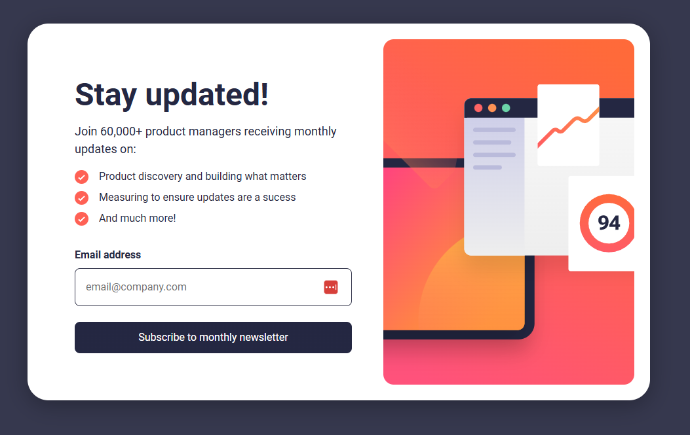
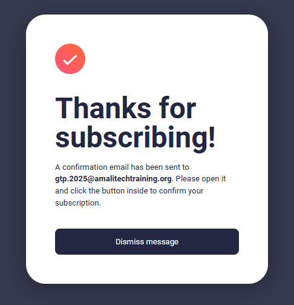

# 🧪 Newsletter Selenium Test Automation

A simple Selenium test project that automatically tests a newsletter subscription form. Perfect for learning test automation!

## 📸 What We're Testing

### Newsletter Page

*The main newsletter subscription form with email input and subscribe button*

### Success Modal

*Success confirmation modal that appears after successful subscription*

## 🎯 What This Project Does

✅ **Tests newsletter subscription form**  
✅ **Validates email input (checks for errors with invalid emails)**  
✅ **Verifies success message after subscription**  
✅ **Runs automatically with GitHub Actions**  
✅ **Sends notifications when tests pass or fail**

## 🚀 Quick Start

### Run Tests Locally
```bash
# 1. Clone this repository
git clone https://github.com/emmanuelarhu/selenium-newsletter-tests.git
cd selenium-newsletter-tests

# 2. Run the tests
mvn test
```

That's it! The tests will open Chrome browser and automatically test the newsletter form.

### Watch Tests Run on GitHub
1. Make any small change to the code
2. Commit and push to GitHub
3. Go to **Actions** tab in your GitHub repository
4. Watch the tests run automatically! 🎉

## 📋 Test Flow

Our test does exactly what a real user would do:

1. **🌐 Opens the newsletter website**
2. **👀 Checks if all page elements are visible** (header, image, form)
3. **❌ Tests invalid email** (enters "ss" and expects error message)
4. **✅ Tests valid email** (enters real email)
5. **🎉 Verifies success modal** appears with correct message
6. **✉️ Confirms email address** shows in confirmation
7. **🖱️ Clicks dismiss button** to close modal
8. **🔄 Verifies return** to main page

## 📁 Project Structure

```
📦 selenium-newsletter-tests/
├── 📁 .github/workflows/
│   └── ci.yml                    # GitHub Actions automation
├── 📁 src/
│   ├── 📁 main/java/pages/
│   │   ├── NewsletterPage.java   # Newsletter form page
│   │   └── SuccessPage.java      # Success modal page
│   └── 📁 test/java/
│       ├── 📁 base/
│       │   └── BaseTest.java     # Test setup
│       └── 📁 tests/
│           └── NewsletterTest.java # Main test
├── 📁 resources/
│   └── chromedriver.exe          # Chrome browser driver
├── 📁 images/                    # Screenshots for README
├── pom.xml                       # Project dependencies
└── README.md                     # This file
```

## 🎮 GitHub Actions Features

The project automatically:
- 🔄 **Runs tests** on every code change
- 📧 **Sends email notifications** when tests pass/fail
- 📱 **Posts to Slack** (if configured)
- 📊 **Saves test reports** you can download
- 📸 **Takes screenshots** if tests fail

## 📧 Getting Notifications

Want to get notified when tests run? Add these to your GitHub repository secrets:

| Secret Name | What It Is | Example |
|-------------|------------|---------|
| `EMAIL_USERNAME` | Your Gmail address | `your.email@gmail.com` |
| `EMAIL_PASSWORD` | Gmail app password | `abcd efgh ijkl mnop` |
| `NOTIFICATION_EMAIL` | Where to send alerts | `team@company.com` |

**How to add secrets:**
1. Go to your GitHub repo → **Settings**
2. Click **Secrets and variables** → **Actions**
3. Click **New repository secret**
4. Add the secrets above

## 🛠️ Technologies Used

- **Java** - Programming language
- **Selenium** - Browser automation
- **JUnit** - Testing framework
- **Maven** - Project management
- **GitHub Actions** - Automatic testing
- **Chrome** - Web browser for testing

## 🐛 Common Issues & Solutions

### "ChromeDriver not found"
**Problem:** Test fails because ChromeDriver is missing  
**Solution:** Make sure `chromedriver.exe` is in the `resources/` folder

### "Tests fail locally but pass on GitHub"
**Problem:** Different Chrome versions  
**Solution:** Download matching ChromeDriver version from [here](https://chromedriver.chromium.org/)

### "No email notifications"
**Problem:** GitHub secrets not set up  
**Solution:** Follow the notification setup guide above

## 👀 Example Test Output

```
🚀 Starting newsletter subscription test
🌐 Navigating to home page...
📍 Navigated to: https://newsletter-signup-form.vercel.app/
📄 'Stay updated!' header found: true
🖼️ Page image found: true
📧 Email entered: ss
⚠️ Error message found: true
⚠️ Error message: Valid email required
📧 Email entered: emmanuelarhu706@gmail.com
✅ Success modal found: true
📄 Success message: Thanks for subscribing!
✅ Success icon: true
📧 Email verification: Expected=emmanuelarhu706@gmail.com, Found=true
✅ Dismiss button clicked
✅ Newsletter subscription test completed successfully!
```

## 🎓 Learning Objectives

This project teaches:
- ✅ **Selenium WebDriver** basics
- ✅ **Page Object Model** design pattern
- ✅ **JUnit testing** framework
- ✅ **CI/CD pipelines** with GitHub Actions
- ✅ **Test automation** best practices
- ✅ **Maven** project structure

## 🤝 Contributing

1. Fork this repository
2. Make your changes
3. Test locally with `mvn test`
4. Create a pull request

## 📞 Support

Need help?
- 📧 **Email:** emmanuelarhu706@gmail.com
- 🐙 **GitHub:** [@emmanuelarhu](https://github.com/emmanuelarhu)
- 💼 **LinkedIn:** [Emmanuel Arhu](https://www.linkedin.com/in/emmanuelarhu)

## 📄 License

This project is for educational purposes. Feel free to use and modify!

---

⭐ **Star this repo if it helped you learn test automation!** ⭐

🎯 **Happy Testing!** 🎯